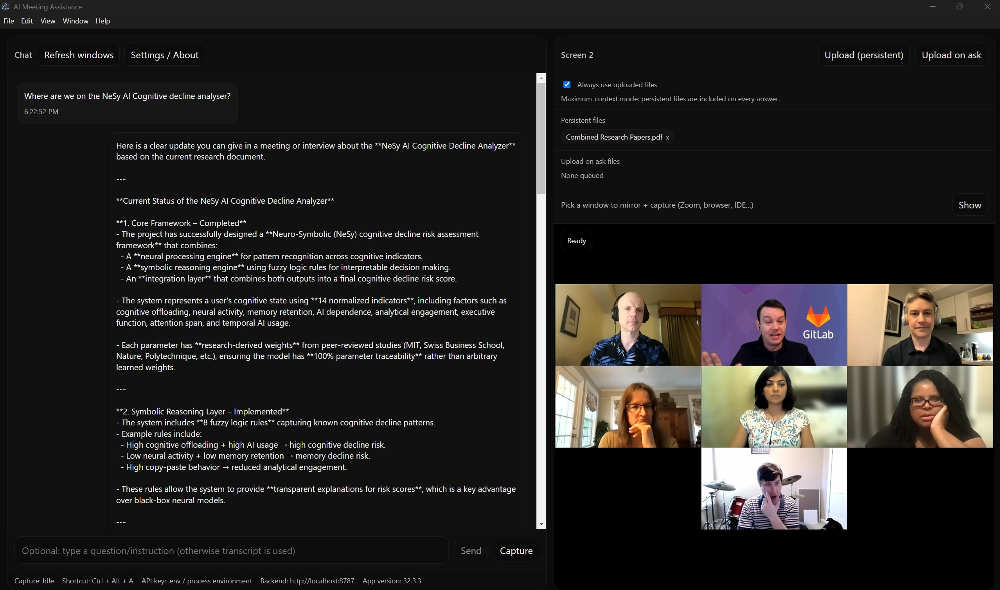

# AI Meeting Assistance

Desktop meeting copilot built with Electron + React + Vite + Express.

It captures system audio from a selected screen/window, keeps a short pre-roll buffer, transcribes speech, and generates detailed AI responses with optional screenshot and file context.



## Highlights

- Windows desktop app (Electron)
- One-click capture toggle:
  - First click: start capture (with ~2s audio pre-roll)
  - Second click: stop + transcribe + answer
- Optional typed question override
- Realtime transcription path + WAV fallback path
- Window/screen mirroring and screenshot capture
- File context support:
  - Upload (persistent)
  - Upload on ask
  - Remove uploaded files from UI
  - `Always use uploaded files` toggle
- Sticky-note popup windows for assistant replies
- Global shortcut: `Ctrl + Alt + A` (works while minimized/unfocused)
- API key can come from `.env` or be entered in-app (Settings/About)
- Windows installer generation with `electron-builder` (NSIS)

## Tech Stack

- Electron (desktop shell + IPC + global shortcuts)
- React + Vite + TypeScript (renderer UI)
- Express + TypeScript (local backend)
- OpenAI API (transcription, responses, optional file search/vector store)

## Install The Desktop App (No Dev Commands)

After you build the installer, you can install the app directly from the `release` folder.

1. Build installer:

```bash
npm run dist:win
```

2. Open this file:

- `release/AI-Meeting-Assistance-Setup-<version>.exe`

3. Run the `.exe` installer.
4. Launch from Start Menu / Desktop shortcut.

You do **not** need to run `npm run dev` after installing the packaged app.

## How It Works

1. Select a source (screen/window) from the right panel.
2. Start capture.
3. Stop capture to trigger:
   - transcript finalization
   - optional screenshot capture
   - answer generation
4. If you typed a prompt, that typed prompt is used as the user question; otherwise transcript is used.
5. Assistant output streams token-by-token in the chat so you can read immediately.

## Prerequisites

- Windows 10/11
- Node.js 20+
- npm 10+
- OpenAI API key

## Installation (Source)

```bash
npm install
```

Create `.env` in the project root:

```env
OPENAI_API_KEY=sk-...
OPENAI_MODEL=gpt-4.1
PORT=8787
# optional fallback budget used by Usage card when OpenAI usage APIs are unavailable
OPENAI_MONTHLY_BUDGET_USD=10
```

If `.env` key is missing, you can still set your key inside the app:

- Open `Settings / About`
- Paste key in the API key section
- Click `Save key`

## Run In Development

```bash
npm run dev
```

Dev processes:

- Renderer (Vite): `http://localhost:5173`
- Local server (Express): `http://localhost:8787`
- Electron app window launches automatically

## Build Production Assets

```bash
npm run build
```

## Build Windows Installer (.exe)

```bash
npm run dist:win
```

Output location:

- `release/AI-Meeting-Assistance-Setup-<version>.exe`
- Unpacked app: `release/win-unpacked/`

Install by running the `.exe` from the `release` folder.

## Run Production App From Source Tree

```bash
npm run start:prod
```

This runs Electron in production mode and serves built frontend/backend assets locally (no Vite dev server).

## Core Usage Guide

1. Launch app.
2. Pick a source to mirror (screen selection is most reliable for system audio).
3. Optionally upload files:
   - `Upload (persistent)` for reusable context
   - `Upload on ask` for one-off context
4. Optionally type a question in the prompt box.
5. Click `Capture` to begin.
6. Click `Stop + Answer` to finalize and get response.
7. For text-only prompts, use `Send` (no capture needed).
8. Use `Ctrl + Alt + A` to toggle capture globally.
9. Responses stream in real time; text appears progressively in the assistant bubble.

## Sticky Notes

Each assistant message has a pop-out action that opens an always-on-top sticky-note window.

- Multiple sticky notes are supported.
- Each popup has its own close button.
- Main window remains usable.

## Usage Card Notes

The UI usage card attempts to show API usage/budget.

- If your key/org lacks billing usage scopes (for example `api.usage.read`), the app falls back to local budget mode and shows a concise warning.
- You can set/edit local fallback budget from the usage section.

## Project Structure

```text
electron/
  main.ts          # BrowserWindow, IPC handlers, sticky-note windows, shortcut registration
  preload.ts       # Secure bridge exposed as window.bridge
  dev-runner.cjs   # Dev entry bootstrap
server/
  standalone.ts    # Local server launcher
  index.ts         # API routes: ask, KB, config, usage, realtime
  realtime.ts      # Realtime transcription/session helpers
  transcribe.ts    # Audio transcription helpers
  kb.ts            # Vector store + file management
src/
  App.tsx          # Main UI + capture flow + app state
  components/      # Chat pane, right pane, picker, message bubbles
docs/
  ARCHITECTURE.md
  API.md
  TROUBLESHOOTING.md
scripts/
  clean-dev-ports.cjs
  write-runtime-package-json.cjs
```

## Troubleshooting

- `Failed to fetch` on startup:
  - Confirm local server started on `http://localhost:8787`
  - Re-run `npm run dev`
- `Error: Request was aborted`:
  - Usually caused by interrupted network/stream lifecycle; restart app and retry once
  - Ensure backend stays running during response streaming
- `MediaRecorder failed to start`:
  - Prefer full screen sources over per-window sources
  - Ensure source has capturable system audio
- Black screen in packaged app:
  - Rebuild (`npm run build`) and reinstall latest installer
  - Confirm production paths are loading `dist/` correctly
- Vite port in use (`5173`):
  - Close stale dev processes and rerun `npm run dev`
  - `predev` already attempts cleanup and a short wait for port release

## Publishing Installer On Your Website

1. Run `npm run dist:win`
2. Upload `release/AI-Meeting-Assistance-Setup-<version>.exe` (from the local `release` folder) to your hosting/storage
3. Point your website download button to that file

## About / Legal

- Built by Ahan Bhatt
- Contact: `bhattahan@gmail.com`
- Website: https://ahanbhatt.github.io/Personal-Website/

Responsible-use disclaimer:

- This app is designed to assist people during meetings.
- It is not intended for unethical use.
- By using this app, you are solely responsible for your actions.
- The developer is not responsible for how users choose to use the app.
